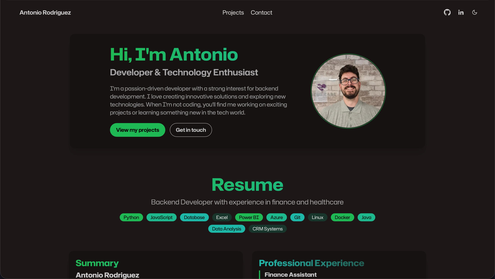

<h1 align="center">Portfolio</h1>

<br><br>

<p align="center">
  

  

  

  

  

  

  
</p>

<!-- Status -->

<p align="center">
  <a href="#dart-about">About</a> &#xa0; | &#xa0;
  <a href="#sparkles-features">Features</a> &#xa0; | &#xa0;
  <a href="#rocket-technologies">Technologies</a> &#xa0; | &#xa0;
  <a href="#white_check_mark-requirements">Requirements</a> &#xa0; | &#xa0;
  <a href="#checkered_flag-starting">Starting</a> &#xa0; | &#xa0;
  <a href="#memo-license">License</a> &#xa0; | &#xa0;
  <a href="https://github.com/antoniorodr" target="_blank">Author</a>
</p>

<br>

## :dart: About

This is my personal portfolio website, built to showcase my projects, skills, and experience as a developer. The design is clean, modern, and fully responsive.

## :sparkles: Features

:heavy_check_mark: Modern, responsive layout  
:heavy_check_mark: Project showcase with descriptions and links  
:heavy_check_mark: About section with skills and experience  
:heavy_check_mark: Contact information or form  
:heavy_check_mark: Easy to customize and extend

## :rocket: Technologies

This project uses:

- [Tailwind CSS](https://tailwindcss.com/)
- [DaisyUI](https://daisyui.com/)
- [Node.js](https://nodejs.org/en/)

## :white_check_mark: Requirements

Before starting, you need to have [Git](https://git-scm.com) and [Node.js](https://nodejs.org/en/) installed.

## :checkered_flag: Starting

```bash
# Clone this project
git clone https://github.com/antoniorodr/portfolio

# Access
cd portfolio

# Install dependencies
npm install

```

## :memo: License

This project is under the MIT license. For more details, see the [LICENSE](LICENSE) file.

## :eyes: Do you like my work?

<a href="https://www.buymeacoffee.com/antoniorodr" target="_blank"></a>

Made with :heart: by <a href="https://github.com/antoniorodr" target="_blank">Antonio Rodriguez</a>

&#xa0;

<a href="#top">Back to top</a>
