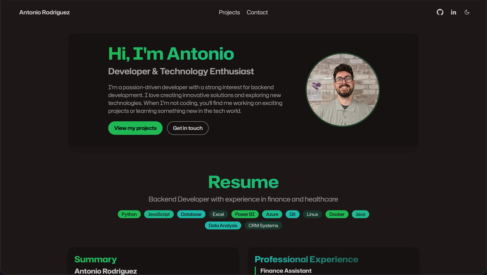

# Portfolio

> [!caution]
> **Status:** Under development

## ℹ️ About

Portfolio is my personal website built to showcase my projects, skills, and experience as a developer. The design is clean, modern, and fully responsive.

## 🎬 Demo



## ✨ Features

- Modern, responsive layout
- Project showcase with descriptions and links
- About section with skills and experience
- Contact information or form
- Easy to customize and extend

## 🛠️ Technologies

The project is built with:

- [Tailwind CSS](https://tailwindcss.com/)
- [DaisyUI](https://daisyui.com/)
- [Node.js](https://nodejs.org/en/)

## 📋 Requirements

Before starting, make sure the required tools and dependencies are installed on your machine:

```bash
node --version
git --version
```

## 📦 Installation

### Manual installation

```bash
git clone https://github.com/antoniorodr/portfolio
cd portfolio
npm install
```

Remember to delete the `CNAME` file from the root of the project.

## 🚀 Getting Started

Once installed, run:

```bash
npm run dev
```

The development server will start and you can view the site in your browser.

## ❤️ Do you like my work?

If you find the project useful, you can support the author here:

[](https://github.com/sponsors/antoniorodr)
