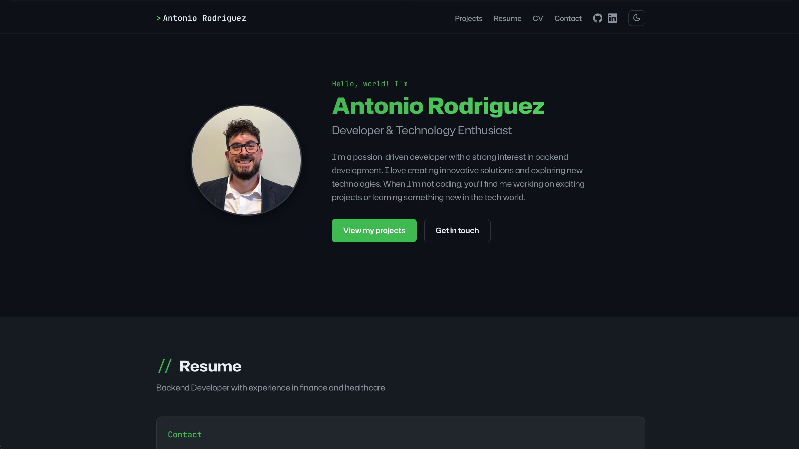

# Portfolio

> [!caution]
> **Status:** Under development

## ℹ️ About

Portfolio is my personal website built to showcase my projects, skills, and experience as a developer. Built with Eleventy and Nunjucks, it features a clean, modern design with dark/light theme support and is fully responsive.

Live site: [antoniorodriguez.no](https://antoniorodriguez.no)

## 🎬 Demo



## ✨ Features

- Modern, responsive layout with dark/light theme toggle
- Hero section with bio and contact actions
- Resume section with skills and experience
- Project showcase with descriptions and links
- Courses modal for displaying completed courses
- Accessible, semantic HTML
- Static site generation for fast load times

## 🛠️ Technologies

The project is built with:

- [Eleventy (11ty)](https://www.11ty.dev/) - Static site generator
- [Nunjucks](https://mozilla.github.io/nunjucks/) - Templating engine
- Vanilla CSS and JavaScript
- [Hubot Sans](https://fonts.google.com/specimen/Hubot+Sans) & [JetBrains Mono](https://fonts.google.com/specimen/JetBrains+Mono) fonts

## 📋 Requirements

Before starting, make sure the required tools and dependencies are installed on your machine:

```bash
node --version
npm --version
git --version
```

## 📦 Installation

### Manual installation

```bash
git clone https://github.com/antoniorodr/portfolio
cd portfolio
npm install
```

Remember to delete the `CNAME` file from the root of the project if you're deploying to your own domain.

## 🚀 Getting Started

Once installed, run:

```bash
npm start
```

The development server will start and you can view the site in your browser. The site will auto-reload when you make changes.

To build for production:

```bash
npm run build
```

The output will be generated in the `_site` directory.

## ❤️ Do you like my work?

If you find the project useful, you can support the author here:

[](https://github.com/sponsors/antoniorodr)
